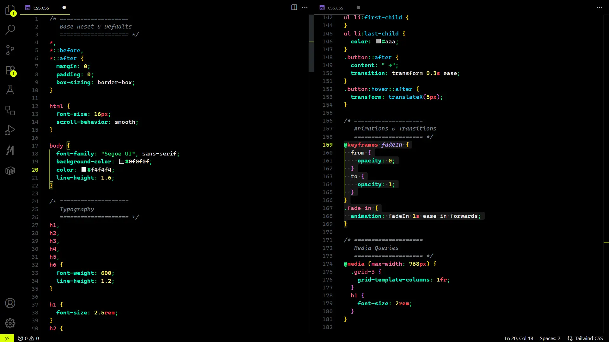

# **Tyrone Neon**

Dark high-contrast theme with neon colors and a minimalist design. Focused on readability and modern aesthetics.

➡️ [Repository](https://github.com/tyronejosee/theme_tyrone_neon)

  
  
  
  
  
  
  
  
  
  
  
  
  
  

## 🖼️ Screenshots

### Python

### JavaScript/TypeScript

### HTML

### CSS

## 🤝 Contributing

1. Clone this repository
2. Open in VS Code
3. Press `F5` to open a new Extension Development Host window
4. Make your changes to the theme file
5. Reload the Extension Development Host to see changes

## 📦 Publishing

To publish this theme to the VS Code Marketplace

1. Install `vsce`: `npm install -g vsce`
2. Create a [Personal Access Token](https://dev.azure.com/) for Azure DevOps
3. Login: `vsce login <publisher-name>`
4. Package: `vsce package`
5. Publish: `vsce publish`

## ⚖️ License

This project is licensed under the MIT License - see the [LICENSE](.LICENSE) file for details.
